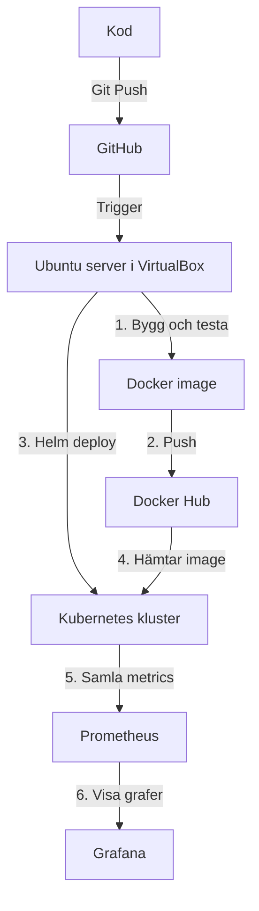

# Kubernetes Pipeline

När jag pushar kod till GitHub sker allt annat automatiskt. GitHub Actions testar koden, bygger en Docker image och pushar den till Docker Hub. Sen deployer Kubernetes den nya versionen automatiskt med Helm.

Tanken är att den som kodar ska kunna fokusera på koden. Pipelinen sköter resten.

## Syfte

Jag gjorde detta projekt för att jag ville prova och lära mig hur verktyg som Docker, Kubernetes och Helm fungerar på riktigt.

## Hur det fungerar

Jag har en egen Ubuntu server i VirtualBox på min dator där allt körs. 

Jag behövde en self hosted runner eftersom vanlig GitHub Actions inte kan nå ett lokalt Kubernetes kluster. Runnern körs direkt på min Ubuntu server så pipelinen når klustret utan problem.

Deployments hanteras med Helm istället för råa kubectl kommandon. Det gör det enklare och smidigare att uppdatera appen i klustret. Pipelinen körs med `helm upgrade --install` så allt installeras automatiskt om klustret är tomt, annars görs en vanlig uppdatering.

Prometheus samlar in metrics från klustret som CPU, minne och status på pods. Grafana visualiserar det som grafer så man kan se vad som händer i realtid.

### Flödesdiagram

## Mappen k8s

Filerna i `k8s/` var mina första manifest. I början deployade jag appen för hand med `kubectl apply` på varje fil. Problemet var att jag fick ändra i filerna varje gång jag skulle uppdatera något. Så jag bytte till Helm för att slippa det. Manifesten ligger kvar som referens, men pipelinen använder Helm-charten i `myapp/` nu.

## Teknik

* VirtualBox med Ubuntu server för miljö
* Docker för containerisering
* Kubernetes med Minikube för att köra och hantera containers
* Helm för deployments
* GitHub Actions med self hosted runner för CI CD
* Prometheus för metrics
* Grafana för dashboards och grafer

## Detta krävs för att köra

1. En aktiv GitHub Actions runner igång på servern
2. GitHub Secrets för `DOCKER_USERNAME` och `DOCKER_PASSWORD`
3. Minikube och Helm installerat på servern
 
 
 
 
 
